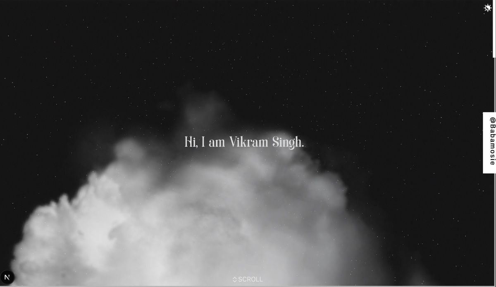

# ✦ Vikram Singh — Portfolio

> *Frontend engineer by profession. Creative at heart.*

A cinematic, scroll-driven 3D portfolio built with **Next.js**, **Three.js / React Three Fiber**, and **GSAP** — featuring immersive WebGL scenes, portal-based navigation, and a dark/light theme system.

**Live →** [cloudframe_folio.vercel.app](https://cloudframe_folio.vercel.app)

---

## ✦ Preview



---

## ✦ Features

- **Immersive 3D Hero** — Stars, volumetric clouds, and a real-time window model with scroll-driven animations
- **Portal Navigation** — Click-into portals to explore the Work and Projects sections without leaving the page
- **Work Timeline** — A CatmullRom curve timeline that tracks your camera through career milestones as you scroll
- **Projects Carousel** — A semicircular carousel of project tiles with hover-reveal animations and one-click launch
- **Theme Switcher** — Persistent light/dark themes powered by Zustand with GSAP color transitions
- **Scroll-Driven Camera** — The entire experience is choreographed around scroll progress — no traditional page routing
- **Mobile Responsive** — Touch-pan controls, triangle-geometry grid tiles, and adaptive layouts for mobile
- **Performance** — Adaptive DPR, model preloading, and `AdaptiveDpr` to keep frame rates healthy

---

## ✦ Tech Stack

| Layer | Technology |
|---|---|
| Framework | Next.js 16 (App Router) |
| 3D Engine | Three.js + React Three Fiber + Drei |
| Animation | GSAP + @gsap/react |
| State | Zustand |
| Styling | Tailwind CSS |
| Fonts | Soria (serif) · Vercetti (sans) |
| Linting | ESLint + Husky + lint-staged |
| Deployment | GitHub Pages / Vercel |

---

## ✦ Project Structure

```
app/
├── components/
│   ├── common/          # Canvas loader, preloader, theme switcher, scroll hint
│   ├── experience/      # Grid tiles, work timeline, projects carousel
│   │   ├── projects/    # Carousel, tiles, touch controls
│   │   └── work/        # Timeline + Memory 3D model
│   ├── footer/          # Animated social links
│   ├── hero/            # Hero text + TextWindow model
│   └── models/          # GLTF models: Cloud, Stars, Memory, Wanderer, Window
├── constants/           # Footer links, project list, work timeline data
├── stores/              # Zustand stores: portal, scroll, theme
└── types/               # TypeScript interfaces
```

---

## ✦ Getting Started

### Prerequisites

- Node.js ≥ 18
- npm

### Install & Run

```bash
# Clone the repository
git clone https://github.com/babamosie333/cloudframe_portfolio.git
cd cloudframe_portfolio

# Install dependencies
npm install

# Start the dev server
npm run dev
```

Open [http://localhost:3000](http://localhost:3000) in your browser.

### Build for Production

```bash
npm run build
npm start
```

---

## ✦ Deployment

The project is configured for **GitHub Pages** via a GitHub Actions workflow (`.github/workflows/nextjs.yml`). On every push to `master`, Next.js builds a static export and deploys it automatically.

It also runs cleanly on **Vercel** with zero configuration.

---

## ✦ Environment Variables

| Variable | Purpose |
|---|---|
| `GA_MEASUREMENT_ID` | Google Analytics measurement ID (production only) |

Create a `.env.local` file at the root and add your values:

```env
GA_MEASUREMENT_ID=G-XXXXXXXXXX
```

---

## ✦ Customisation

**Projects** — Edit `app/constants/projects.ts`  
**Work Timeline** — Edit `app/constants/work.ts`  
**Social Links** — Edit `app/constants/footer.ts`  
**Themes** — Edit `app/stores/themeStore.ts`  
**3D Models** — Drop `.glb` files in `public/models/` and wire them up in `app/components/models/`

---

## ✦ Credits

3D assets used under Creative Commons:

- *Dali, The Persistence of Memory* — [arloopa](https://sketchfab.com/arloopa) · CC-BY-4.0
- *Wanderer above the Sea of Fog* — [betocarrillo](https://sketchfab.com/betocarrillo) · CC-BY-SA-4.0
- *Residential Window* — [AleixoAlonso](https://sketchfab.com/AleixoAlonso) · CC-BY-4.0

---

## ✦ License

Personal portfolio — all rights reserved. Feel free to draw inspiration, but please don't copy and deploy as your own.

---

<p align="center">Made with ☕ and Three.js by <strong>Vikram Singh</strong></p>
